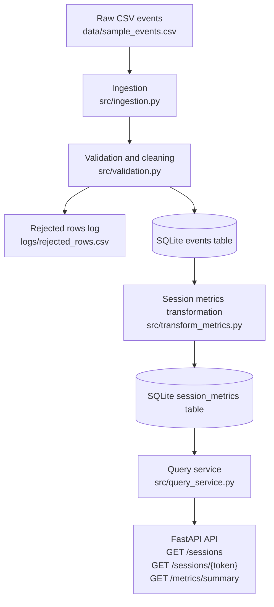
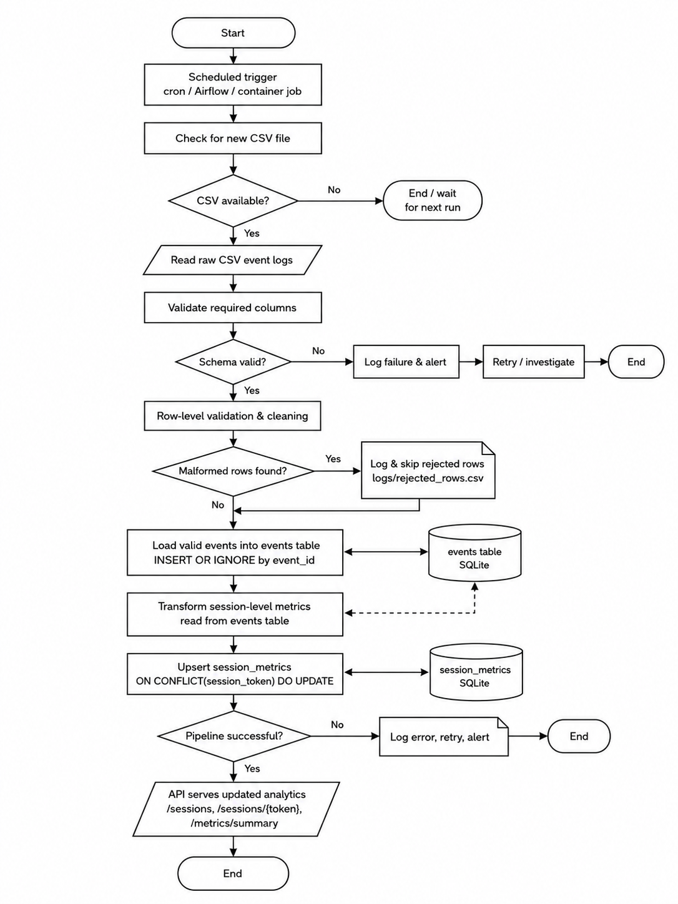

# Event-Driven User Analytics Pipeline

User Analytics Pipeline is a lightweight backend data pipeline for application event logs. It ingests raw CSV events, validates and cleans rows, stores valid events in SQLite, transforms them into session-level metrics and exposes the results through a FastAPI REST API.

The pipeline is kept small and easy to run locally. The code is split by responsibility so each part can be run, checked and tested independently, which aim to be modular pipeline system.

## Architecture Overview



## Quick Start

Requires Python 3.10 or newer.

Run these commands from the project root.

Windows:

```bash
python -m venv venv
venv\Scripts\activate
pip install -r requirements.txt
python src/generate_sample_data.py
python src/profile_data.py
python src/run_pipeline.py
pytest
uvicorn src.main:app --reload
```

macOS or Linux:

```bash
python3 -m venv venv
source venv/bin/activate
pip install -r requirements.txt
python src/generate_sample_data.py
python src/profile_data.py
python src/run_pipeline.py
pytest
uvicorn src.main:app --reload
```

Open Swagger UI at:

```text
http://localhost:8000/docs
```

The `uvicorn` command keeps the API server running in that terminal. Generated files such as `data/user_analytics.db` and `logs/rejected_rows.csv` are ignored by git.

## Implementation Coverage

| Requirement area | Approaches to satisfy |
| --- | --- |
| Data exploration | `src/profile_data.py` reports nulls, duplicate `event_id` values, latency summary statistics, IQR outliers, event type counts, and device type counts. |
| Data modelling | `sql/schema.sql` defines `events` for cleaned raw events and `session_metrics` for API-ready session aggregates. |
| Ingestion | `src/ingestion.py` reads the CSV with pandas, validates required columns, validates each row, and separates accepted and rejected rows. |
| Malformed row handling | Invalid rows are skipped and written to `logs/rejected_rows.csv` with a source row number and rejection reason. |
| Loading | `src/load_events.py` inserts valid rows into SQLite using `INSERT OR IGNORE` so duplicate `event_id` values do not crash or duplicate data. |
| Transformation | `src/transform_metrics.py` reads from the `events` table and computes session-level metrics. It does not recompute from CSV. |
| Metrics loading | `src/load_metrics.py` upserts metrics into `session_metrics` using `session_token` as the conflict key. |
| API serving | `src/main.py` exposes `GET /sessions`, `GET /sessions/{token}` and `GET /metrics/summary`. |
| Testing | `tests/` covers validation, event loading idempotency, metric transformation, metric upsert behavior, API responses, pagination validation, 404 behavior and empty database responses. |

## Design Rationale

| Design choice | Why it was chosen | Tradeoff |
| --- | --- | --- |
| CSV batch ingestion | The source is a raw event log export, so CSV keeps the local workflow easy to run and inspect. | Streaming analytics would need a queue or event bus. |
| Pandas for CSV reading and profiling | Pandas gives clear support for loading, null checks, duplicates, and summary statistics. | Very large files would need chunking or a distributed tool. |
| Explicit row validation before loading | Invalid data is easier to explain and reject before it reaches the database. | Validation rules must evolve with source schema changes. |
| Log and skip malformed rows | A few bad rows should not stop the batch, and rejected rows remain reviewable. | Production handling would need more context for each rejected row. |
| SQLite database | SQLite keeps setup simple while still using relational tables, keys, indexes, and SQL queries. | Higher concurrency or larger deployments would need PostgreSQL. |
| Separate `events` and `session_metrics` tables | Cleaned raw events remain auditable, while precomputed metrics keep API reads simple. | Metrics must be refreshed when new events are loaded. |
| Idempotent loading | `event_id` ignores duplicate events, and `session_token` upserts refresh metrics safely. | Corrected duplicate events would need an explicit update strategy. |
| FastAPI serving layer | FastAPI provides concise routes, request validation, response models, and Swagger documentation. | A public API would need authentication, rate limits, and request logging. |

## Repository Structure

```text
USER_ANALYTICS_PIPELINE/
|-- README.md
|-- requirements.txt
|-- data/
|   `-- sample_events.csv
|-- docs/
|   `-- flowchart-drawio.png
|-- sql/
|   `-- schema.sql
|-- src/
|   |-- __init__.py
|   |-- api_schemas.py
|   |-- config.py
|   |-- database.py
|   |-- generate_sample_data.py
|   |-- ingestion.py
|   |-- load_events.py
|   |-- load_metrics.py
|   |-- main.py
|   |-- profile_data.py
|   |-- query_service.py
|   |-- run_ingestion.py
|   |-- run_pipeline.py
|   |-- run_transform.py
|   |-- transform_metrics.py
|   `-- validation.py
`-- tests/
    |-- __init__.py
    |-- test_api.py
    |-- test_load_events.py
    |-- test_load_metrics.py
    |-- test_transform_metrics.py
    `-- test_validation.py
```

## Database Choice

SQLite is used because it is free, lightweight, serverless, and easy to run locally without a separate database server. It is a good fit for this CSV-based batch pipeline because ingestion runs in batches and the API primarily serves read queries over prepared metrics.

For a larger production deployment, PostgreSQL would be the preferred upgrade. It handles concurrency better and has stronger support for backups, permissions, and indexing.

## Database Schema

`events` stores cleaned raw event records:

- `event_id` is the primary key and prevents duplicate raw event ingestion.
- `session_token` links events into a user session without storing personal identifiers.
- `event_type`, `timestamp`, `device_type`, and `response_time_ms` keep the fields needed for behavioral metrics.
- `ingested_at` records when SQLite inserted the event.

`session_metrics` stores one aggregate row per session:

- `session_token` is the primary key.
- `total_events` counts valid events in the session.
- `session_duration_seconds` stores the time between first and last event.
- `dominant_device` stores the most frequent device type.
- `average_latency_ms` stores average backend latency.
- `first_event_time` and `last_event_time` support timeline queries.
- `updated_at` changes when a metrics row is refreshed.

Indexes:

- `events(session_token)` speeds up session lookups.
- `events(timestamp)` supports time-based filtering and ordering.
- `events(event_type)` supports event-type breakdowns.
- `session_metrics(average_latency_ms)` supports latency-based filtering and ranking.

## Data Profiling

Run:

```bash
python src/profile_data.py
```

The profiling script reports:

- total row count
- missing values by column
- duplicate `event_id` count
- invalid or negative `response_time_ms` count
- response time summary statistics
- IQR-based latency outlier count
- `event_type` breakdown
- `device_type` breakdown

Very high latency values are profiled as outliers, will not automatically rejected.

## Ingestion and Validation

Run ingestion only:

```bash
python src/run_ingestion.py
```

Validation rules:

- Required columns must exist: `event_id`, `session_token`, `event_type`, `timestamp`, `device_type`, and `response_time_ms`.
- `event_id`, `session_token`, and `event_type` must not be empty.
- `timestamp` must be parseable as an ISO 8601 timestamp with timezone information.
- `device_type` must be `mobile`, `desktop`, or `tablet`. Input is accepted case-insensitively and stored in lowercase.
- `response_time_ms` must be an integer greater than or equal to zero.

Malformed rows are skipped instead of crashing the pipeline. Rejected rows are written to `logs/rejected_rows.csv` with a source row number and reason.

Event loading is idempotent because `event_id` is the primary key and `src/load_events.py` uses SQLite `INSERT OR IGNORE`.

## Session Metrics Transformation

Run transformation only after events have been loaded:

```bash
python src/run_transform.py
```

The transformation reads from the `events` table, not directly from CSV.

Aggregation logic:

- `total_events`: count all stored events for the session.
- `first_event_time`: earliest event timestamp.
- `last_event_time`: latest event timestamp.
- `session_duration_seconds`: difference between last and first event in seconds. A one-event session has duration `0`.
- `dominant_device`: most frequent `device_type`; ties are resolved alphabetically.
- `average_latency_ms`: average `response_time_ms`, rounded to two decimal places. Valid high-latency outliers are included.

Metrics loading is idempotent because `session_metrics.session_token` is the primary key and loading uses:

```sql
INSERT ... ON CONFLICT(session_token) DO UPDATE
```

## Full Local Pipeline

Run the complete local flow:

```bash
python src/run_pipeline.py
```

This command:

- initializes the SQLite schema
- ingests and validates `data/sample_events.csv`
- writes rejected rows to `logs/rejected_rows.csv`
- loads valid events into `events`
- transforms session metrics from stored events
- upserts results into `session_metrics`

The command is safe to rerun. Existing events are not being duplicated and session metrics are refreshed.

## API Design and Serving Layer

Prepare data first:

```bash
python src/run_pipeline.py
```

Start the API:

```bash
uvicorn src.main:app --reload
```

Swagger UI:

```text
http://localhost:8000/docs
```

The project exposes analytics through REST endpoints. FastAPI's Swagger UI is available for local API exploration and testing.

### GET /

Health and endpoint information.

Example response:

```json
{
  "project": "USER_ANALYTICS_PIPELINE",
  "status": "ok",
  "endpoints": [
    "GET /sessions",
    "GET /sessions/{token}",
    "GET /metrics/summary"
  ]
}
```

### GET /sessions

Lists records from `session_metrics`.

Query parameters:

- `page`: default `1`, must be at least `1`.
- `page_size`: default `20`, must be between `1` and `100`.

Example response:

```json
{
  "page": 1,
  "page_size": 20,
  "total_sessions": 36,
  "total_pages": 2,
  "sessions": [
    {
      "session_token": "session_001_hash",
      "total_events": 7,
      "session_duration_seconds": 445.0,
      "dominant_device": "tablet",
      "average_latency_ms": 176.57,
      "first_event_time": "2026-07-01T09:08:00Z",
      "last_event_time": "2026-07-01T09:15:25Z"
    }
  ]
}
```

### GET /sessions/{token}

Retrieves metrics for one `session_token`.

Example response:

```json
{
  "session_token": "session_001_hash",
  "total_events": 7,
  "session_duration_seconds": 445.0,
  "dominant_device": "tablet",
  "average_latency_ms": 176.57,
  "first_event_time": "2026-07-01T09:08:00Z",
  "last_event_time": "2026-07-01T09:15:25Z"
}
```

Missing token response:

```json
{
  "detail": "Session not found: unknown_session"
}
```

### GET /metrics/summary

Returns dataset-wide aggregates from `events` and `session_metrics`.

Example response:

```json
{
  "total_events": 291,
  "average_session_duration_seconds": 448.97,
  "event_type_breakdown": {
    "api_call": 93,
    "button_click": 98,
    "page_view": 100
  },
  "p95_latency_ms": 261.0
}
```

`p95_latency_ms` is calculated in Python from stored `response_time_ms` values using linear interpolation over the sorted latency list. SQLite does not provide a built-in percentile aggregate.

Error handling:

- Missing session token returns `404`.
- Invalid pagination returns `422` through FastAPI request validation.
- Empty database returns clean empty or zero values. `/sessions` returns an empty list, and `/metrics/summary` returns `total_events: 0`, an empty event breakdown, and `p95_latency_ms: null`.

## Testing

Run all tests:

```bash
pytest
```

The tests use temporary SQLite databases where needed, so they do not require a manually created local database.

## Known Assumptions

- Input CSV files follow the expected event log schema.
- Timestamps are expected to include timezone information and are normalized to UTC.
- Very high latency values are treated as valid outliers, not rejected records.
- Duplicate `event_id` rows are ignored to keep ingestion idempotent.
- SQLite is used for local reproducibility.
- The API serves already-prepared data; it does not trigger ingestion or transformation on request.

## Production Considerations

Production orchestration could follow this flow:



In local development, run the flow manually with:

```bash
python src/run_pipeline.py
```

In production, this could be scheduled using cron, Airflow, GitHub Actions, or a containerized job. Failed runs should be logged and alerted. Idempotency is handled by `event_id` uniqueness in `events` and `session_token` upserts in `session_metrics`.

### Challenges and Future Improvements

| Area | Potential challenge | Future improvement |
| --- | --- | --- |
| Database scalability | SQLite is not intended for high-concurrency production workloads. | Move to PostgreSQL for stronger concurrency, backups, access control and operational tooling. |
| Pipeline observability | Terminal summaries are useful locally but production runs should keep logs for later debugging. | Add structured logs, run IDs, row counts, runtime duration and success or failure status. |
| Rejected data handling | A single rejected-rows CSV can become hard to analyze over time. | Store rejected rows in a table or timestamped files with error categories and source metadata. |
| Schema evolution | A single `schema.sql` file does not manage database changes over time. | Use migrations so schema changes can be versioned, reviewed and rolled back. |
| API security | The current API is designed for local use. | Add authentication, authorization, rate limiting and request logging before public deployment. |
| Data freshness and reliability | The API depends on prepared metrics, so failed or missed runs can leave stale results. | Track last successful runs, add alerts and use retries where safe. |
